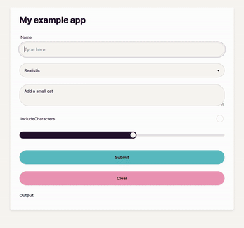

# ⏩ HandiJS

HandiJS is a simple Gradio for NodeJS.

For quickly building form-based applications - like Machine Learning applications.

Built with <a href="https://fastify.dev/">Fastify</a>, <a href="https://tailwindui.com/">Tailwind</a>, <a href="https://daisyui.com/">DaisyUI</a>.

## Installation

`npm i handijs`

## Usage

### Quick example

A web form asking the user for Name and Surname and returning a greeting.

```javascript
import { title, textInput, launchApp, buildApp } from "../index.js"

const app = buildApp({
  ui: [
    title("My example app"),
    textInput({ name: "Name", defaultValue: "" }),
    textInput({ name: "Surname", defaultValue: "" }),
  ],
  onSubmit: async ({ Name, Surname }) => {
    return `Hi ${Name} ${Surname}`
  },
})

launchApp(app) // start the app on http://localhost:3000
```

### More complex example

An image generator using OpenAI's DALL-E.

```javascript
import OpenAI from "openai"

import {
  title,
  textInput,
  select,
  textarea,
  checkbox,
  range,
  launchApp,
  buildApp,
} from "../index.js"

const openai = new OpenAI({ apiKey: process.env.OPENAI_API_KEY })

const ui = [
  title("My example app"),
  textInput({ name: "Name", defaultValue: "A peaceful beach at sunset" }),
  select({
    name: "Style",
    options: ["Realistic", "Cartoon", "Abstract", "Vintage", "Futuristic"],
  }),
  textarea({ name: "AdditionalDetails", defaultValue: "Add a small cat" }),
  checkbox({ name: "IncludeCharacters" }),
  range({ name: "Brightness", min: 1, max: 10, defaultValue: 5 }),
]

const onSubmit = async ({
  ImageDescription,
  Style,
  AdditionalDetails,
  IncludeCharacters,
  Brightness,
}) => {
  const prompt = `
    ImageDescription: ${ImageDescription}
    Style: ${Style}
    Brightness: ${Brightness}
    IncludeCharacters: ${IncludeCharacters}
    AdditionalDetails: ${AdditionalDetails} 
  `

  const response = await openai.images.generate({
    model: "dall-e-3",
    prompt,
    n: 1,
    size: "1024x1024",
  })

  return response.data[0].url
}

const app = buildApp({ ui, onSubmit, outputType: "image" })

launchApp(app)
```

Result will be:


